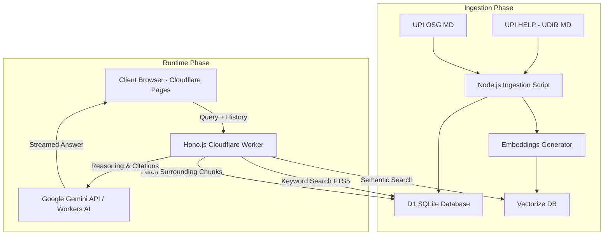

# UPI UDIR & OSG RAG Helper Web Application

A production-ready Retrieval-Augmented Generation (RAG) web application designed to reason across two large technical manuals: **UPI HELP - UDIR** (Dispute resolution protocols) and **UPI OSG** (Operating and Settlement Guidelines). 

Built on a serverless, highly optimized Cloudflare architecture with hybrid retrieval and streaming logic.

---

## Technical Stack

*   **Frontend**: React + TypeScript + Vite + Vanilla CSS (Premium SaaS UI with Glassmorphism and Context Inspector Drawer).
*   **Backend Worker**: Hono.js on Cloudflare Workers.
*   **Database (D1)**: SQLite serverless database with built-in Full Text Search (FTS5).
*   **Vector Database (Vectorize)**: Cloudflare Vectorize (1024-dimension cosine similarity).
*   **Embeddings & LLM**:
    *   **Embeddings**: Workers AI `@cf/baai/bge-large-en-v1.5` (Native & Free).
    *   **LLM Reasoning**: Google Gemini 1.5 Flash (via API) with automatic serverless fallback to Workers AI Llama-3.1-8b-instruct.

---

## Architecture Diagram



---

## Local Setup

### Prerequisites

1.  **Node.js**: Version 18 or higher (Node 26+ installed via brew).
2.  **Cloudflare Wrangler CLI**: Logged in to your Cloudflare account (if deploying/testing remote bindings).

### 1. Install Dependencies

Install root, backend, frontend, and ingestion dependencies:

```bash
# Install monorepo orchestration packages
npm install

# Install ingestion script packages
npm --prefix ingestion install

# Install backend worker packages
npm --prefix backend install

# Install frontend app packages
npm --prefix frontend install
```

### 2. Configure Environment Variables

Copy the `.env.example` file to `.env`:

```bash
cp .env.example .env
```

Edit `.env` and configure your API keys:
*   `GEMINI_API_KEY`: Paste your Google Gemini API key here for high-fidelity cross-document reasoning.

---

## Ingestion & Database Setup (Local Dev)

To test the application locally with a mock local database and Vectorize instance, Cloudflare Wrangler supports local emulation.

### 1. Bootstrap Local D1 Database Schema
In the worker backend, we expose a secure reset endpoint to create the SQLite schemas and FTS5 search index dynamically:

Start the local worker dev server:
```bash
npm run dev:backend
```

In another terminal, run the ingestion script to parse the documents, chunk them, generate local embeddings, and index them into the local D1/Vectorize bindings:
```bash
npm run ingest
```

The ingestion script will:
1.  Read `documents/upi_udir.md` and `documents/upi_osg.md`.
2.  Parse pages, headings (sections), and image references.
3.  Transmit chunks to the running worker in sequential batches of 25 to prevent timeout constraints.

---

## Local Development Execution

To start both the frontend Vite app and the backend Worker concurrently:

```bash
npm run dev
```

*   **Vite Frontend**: [http://localhost:3000](http://localhost:3000)
*   **Hono Worker Backend**: [http://localhost:8787](http://localhost:8787)

---

## Deployment to Cloudflare (Production)

Follow these steps to deploy the production-ready databases and application to your Cloudflare dashboard:

### 1. Create D1 Database
Create the production D1 database:
```bash
npx wrangler d1 create udir_rag_db
```
Copy the `database_id` output and paste it into the `database_id` field in `backend/wrangler.toml`.

### 2. Create Vectorize Index
Create the production vector index matching our `@cf/baai/bge-large-en-v1.5` 1024-dimension embedding model:
```bash
npx wrangler vectorize create udir_rag_vectors --dimensions=1024 --metric=cosine
```

### 3. Configure Production Secrets
Add your Google Gemini API key as a secret on the worker:
```bash
npx wrangler secret put GEMINI_API_KEY
```

### 4. Deploy the Backend Worker
Deploy the worker:
```bash
npm --prefix backend run deploy
```

### 5. Deploy Frontend to Cloudflare Pages
1.  Build the frontend asset bundle:
    ```bash
    npm --prefix frontend run build
    ```
2.  Deploy the generated bundle (`frontend/dist`) to Cloudflare Pages:
    ```bash
    npx wrangler pages deploy frontend/dist
    ```

---

## Running Evaluation Suite

To validate parser logic, retrieval precision, and keyword matches:

```bash
# Make sure backend dev server is running on localhost:8787
npx tsx tests/evaluate.ts
```
